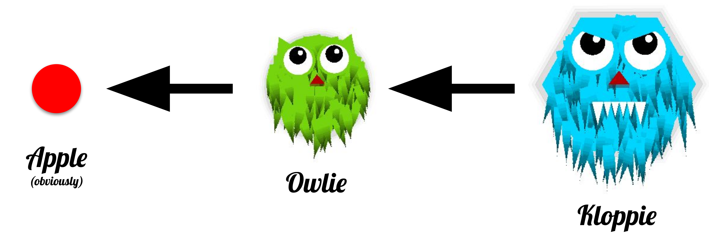
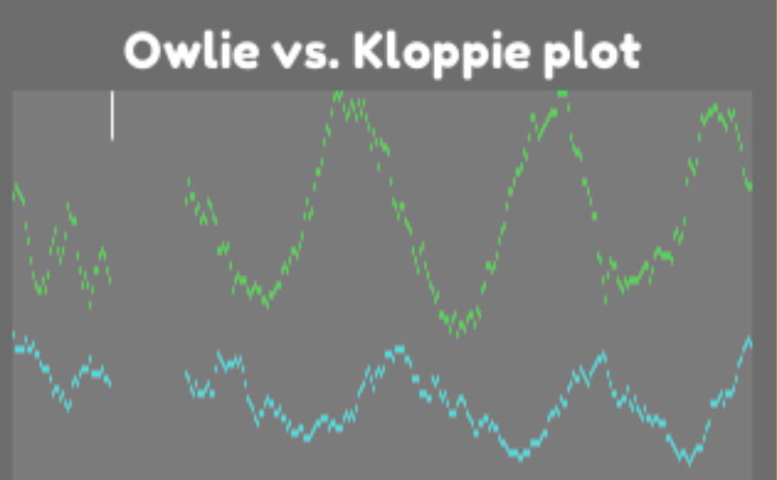

<h1 align="center">Boppie Evolution</h1>

---

# Try it [online](https://boppie-evolution.brutenis.net)! 

## A Simulation of Natural Selection based on Owl-like Creatures with Neural Networks


## Explanation

There are two types of boppies: owlies and kloppies. The owlies eat the red dots (apples), and the kloppies eat the owlies. 



Each creature has a small neural network which tells it what to do. The neural network has two outputs, go forward/backwards and turn left/right. Notice in the gif below the two output nodes.
Currently each creature has 5 inputs (+1 bias/threshold), each input shows the distance (0 = no food, 0.5 = very far, 1.0 = very close) to the next food. As in, the neuron fires when it sees
food there.


## Observations

Based on this basic neural network and evolution some interesting behaviour emerges. For example, the
[prey-predator](https://en.wikipedia.org/wiki/Lotka%E2%80%93Volterra_equations) cycle appears after some time, just as it does in nature:



## Running it

You can play with it [online](https://boppie-evolution.brutenis.net) with a web browser.
For better performance you can download the binaries [here](https://github.com/LiquidFun/BoppieEvolution/releases/tag/0.1.0) (Linux, Windows and Mac are all provided, the latter two have not been tested though).

## Hotkeys

Quickstart: after starting a simulation: press `9` to simulate quickly. After a couple minutes you can press `1` to go to normal speed and inspect what the creatures are now capable of!

* `H` - See help page for up-to-date hotkey list (or click on the question mark in the bottom right corner)
* `W`/`A`/`S`/`D` - move camera around (hold **shift** to move 10x as fast)
* `Mouse click and drag` - move camera around
* `Mouse click` on boppie - follow it until it dies
* `Mouse wheel` - zoom in/out
* `Escape` - stop following boppie
* `O`/`K` - follow fittest **o**wlie/**k**loppie until it dies
* `P` - turn performance mode on/off (off by default). This improves FPS by a lot by turning off all particles and unnecessary visual effects. This is done automatically when changing to a time factor above 32x.
* `F` - **f**ollow new fittest boppie even after death
* `C` - toggle **c**ontrol of boppie if already following it (i.e. clicked on it before) (use `W`/`A`/`S`/`D` to move with it)
* `E` - add 5 **e**nergy to currently following boppie (press multiple times, then the boppie will grow and have children)
* `-`/`+` - decrease/increase time factor by 2x (min: 0.5x, max: 256x)
* Numbers `1` through `9` - set time factor to 2^(number - 1)  (e.g.: pressing 9 sets time factor to 256x)
* `Space` - pause/unpause
* `R` - show vision **r**ays for all boppies
* `T` - show vision rays for curren**t** boppie

## If you want to tinker yourself

* Download the free and open source game-engine: [Godot](https://godotengine.org/)
* Clone this repository: `git clone https://github.com/LiquidFun/BoppieEvolution` (or download via github)
* Open Godot and import the `project.godot` file
* Now press on the play button to run it 

## Ideas for features

### Simulation

* Implement NEAT (Neuroevolution of Augmenting Topologies), such that the neural networks of the boppies change with each generation
    * Innovation number (tracking of changes between species)
    * Different parallel simulations where the best are merged into 1
    * Merging of neural networks
* Add obstacles
* Add more senses for the boppies, such as:
    * Instead of rays try neural network inputs with information for angle+distance
    * Cone for detection of food
    * Your own kin (so that ant-like behaviour could emerge)
    * Timer
* Add sexual reproduction, as in the real world merging DNA from two individuals has greatly benefited survival of the fittest
* Add loading/saving of simulations
* Add areas of high ground productivity (where more food spawns)
* Make boppies leave flesh after death
* Change meat-eating from boolean to a float, where it essentially becomes meat-tolerance or meat effectiveness (a factor of how much energy can be gained from meat). However high meat-tolerance means low 
* Add boppie color as part of DNA 
    * Ideas: 
        * HSL (where H is part of DNA, S shows energy, L = .5 or meat-tolerance )
        * RGB (where R, G is part of DNA, B shows meat-tolerance)
* Add reinforcement learning
    * Save which neurons most contributed to a reward in the last seconds (eating)/penalty (taking damage), increase the weights of those connections

### UI/UX
* Add menu so that simulation could be configured
* Show additional senses (dangersense) near boppie
* DNA/Neural network as tabs, as they do not fit in a single column

## Changelog

### v0.2.0 (not yet released)

* Neural networks can have any structure (not necessarily fully connected)
* Added rotating traps with spikes and blood marks after death
* Added these senses for boppies:
    * Danger sense (for detecting traps and kloppies)
* Camera can now be moved with dragging the mouse
* Random seed is shown 
* Neural networks now show what each input/output neuron means

### v0.1.0 (2021-10-19)

* Two types of creatures (Owlies and Kloppies)
* A basic neural network for each creature
* Creatures have DNA which they pass on to children
* Vision based on 5 rays extending from each boppie


## Example DNA

To quickly get a smart boppie: click on a boppie (both owlies and kloppies accept the same DNA currently), then highlight the DNA (the JSON-like dictionary on the right) and paste the dictionary below. After that click on the button above the DNA saying `Apply DNA`. You should see the boppie behaviour change.

```json
{
"ai.weights": [ [ [ 0.8752, -1.08406, 0.555625, 0.461732, -0.0153107, 1.60833 ], [ -0.772722, 0.891377, -1.54916, -0.189993, -0.303271, 0.0107722 ] ] ],
"generation.i": 160,
"max_backwards_factor": -0.74617,
"max_boost_factor": 1.96055,
"max_energy": 28.0945,
"move_speed": 99.4101,
"offspring_mutability": 0.01,
"ray_angle": 0.693964,
"ray_length": 457.06,
"required_offspring_energy": 8.46333,
"turn_speed": 2.86812
}
```

## Inspired by

* [Evolution simulator](https://www.youtube.com/watch?v=GOFws_hhZs8) by [carykh](https://www.youtube.com/channel/UC9z7EZAbkphEMg0SP7rw44A)
* [Evolv.io](https://www.youtube.com/watch?v=C9tWr1WUTuI) by [carykh](https://www.youtube.com/channel/UC9z7EZAbkphEMg0SP7rw44A)
* [MarI/O](https://www.youtube.com/watch?v=qv6UVOQ0F44) by [SethBling](https://www.youtube.com/channel/UC8aG3LDTDwNR1UQhSn9uVrw)
* [Simulating Natural Selection](https://www.youtube.com/watch?v=0ZGbIKd0XrM) by [Primer](https://www.youtube.com/channel/UCKzJFdi57J53Vr_BkTfN3uQ)
